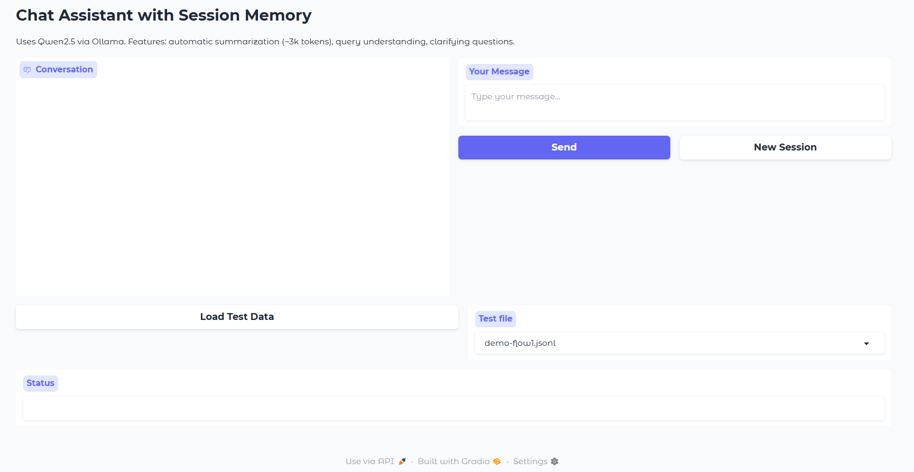

# Chat Assistant with Session Memory



A multi-language Python chat assistant powered by **Qwen2.5 (via Ollama)**, featuring **automatic conversation summarization**, **intelligent query understanding**, and **interactive clarification workflows**.

---

## Table of Contents

- [Overview](#overview)
- [Features](#features)
- [Prerequisites](#prerequisites)
- [Setup Instructions](#setup-instructions)
- [How to Run the Demo](#how-to-run-the-demo)
- [High-Level Design Explanation](#high-level-design-explanation)
- [Project Architecture](#project-architecture)
- [Usage Guide](#usage-guide)
- [Demo Structure & Results](#demo-structure--results)
- [Assumptions & Limitations](#assumptions--limitations)
- [Future Enhancements](#future-enhancements)

---

## Overview

This chat assistant is designed to handle **long, context-rich conversations** by intelligently managing memory through summarization and understanding user queries through a multi-stage analysis pipeline.

**Key Use Cases:**
- Long-form educational conversations (career guidance, technical topics)
- Customer support with contextual awareness
- Research discussions with automatic note-taking
- Multi-turn clarification workflows for ambiguous queries

---

## Features

### 1. **Automatic Session Summarization**
- When conversation exceeds **~3000 tokens** (configurable), the system automatically creates a summary
- Summarization extracts:
  - **User Profile** (preferences, constraints, interests)
  - **Key Facts** from the conversation
  - **Decisions** made or agreed upon
  - **Open Questions** requiring follow-up
  - **Todos** or action items
- Full message history is preserved; summary acts as compressed memory context
- Efficient token management keeps the conversation window within limits

### 2. **Intelligent Query Understanding Pipeline**
When a user sends a message, the system:
1. **Detects Ambiguity** - Identifies queries with multiple interpretations or missing context
2. **Rewrites Queries** - Clarifies vague or ambiguous questions
3. **Augments Context** - Pulls relevant information from session memory
4. **Generates Clarifying Questions** - Asks 1-3 focused questions if clarification is needed
5. **Computes Confidence Score** - Estimates understanding certainty (0.0-1.0)

### 3. **Multi-Language Support**
- Automatically detects language (Vietnamese, English, Chinese)
- Responds in the same language as user input
- Prevents language mixing in outputs
- Supports diacritical marks and special characters

### 4. **Interactive Clarification Workflow**
- When query is ambiguous, assistant asks clarifying questions instead of guessing
- User provides clarification
- System combines original query + clarification for better understanding
- Responds with full context awareness

### 5. **Session Persistence**
- Conversations saved as JSON files in `storage/sessions/`
- Each session has:
  - Full conversation state
  - Separate summary file (for analysis)
  - Timestamp and metadata
- Easy to load and resume sessions

---

## Prerequisites

**System Requirements:**
- **Python 3.9** or higher
- **8GB RAM** minimum (16GB+ recommended for smooth operation)
- **Ollama** installed and running locally
- **Windows, macOS, or Linux**

**Software:**
- [Ollama](https://ollama.ai) - Local LLM runtime
- [Python](https://python.org) - Programming language
- Dependencies listed in `requirements.txt`

---

## Setup Instructions

### Step 1: Install Ollama

1. Download from [ollama.ai](https://ollama.ai)
2. Install and launch the application
3. Verify installation by opening a terminal and running:
   ```bash
   ollama --version
   ```

### Step 2: Pull the Qwen2.5 Model

Open a terminal and run:
```bash
ollama pull qwen2.5:7b
```

This downloads the **7B parameter Qwen2.5 model** (approximately 4.5GB).  
**Note:** First-time pull may take 5-10 minutes depending on internet speed.

**Verify the model is installed:**
```bash
ollama list
```

You should see `qwen2.5:7b` in the output.

### Step 3: Verify Ollama Service is Running

Make sure Ollama is running by checking:
```bash
curl http://localhost:11434/api/tags
```

You should receive a JSON response listing available models.

### Step 4: Clone/Setup Project

Navigate to the project directory:
```bash
cd chat-assistant
```

### Step 5: Create Python Virtual Environment (Recommended)

```bash
python -m venv venv

# Windows
venv\Scripts\activate

# macOS/Linux
source venv/bin/activate
```

### Step 6: Install Python Dependencies

```bash
pip install -r requirements.txt
```

**Dependencies included:**
- `pydantic>=2.0.0` - Data validation and models
- `langchain-community>=0.2.0` - LLM integration framework
- `gradio>=4.0.0` - Web UI framework

### Step 7: Verify Configuration

Edit `config/settings.py` if needed:
```python
MAX_TOKENS = 3000           # Threshold to trigger summarization
MODEL = "qwen2.5:7b"        # LLM model name
OLLAMA_BASE_URL = "http://localhost:11434"  # Ollama endpoint
STORAGE_DIR = "storage/sessions"  # Where sessions are saved
```

---

## How to Run the Demo

### Quick Start

1. Ensure **Ollama is running** with the model loaded
2. Activate your Python environment (if using venv)
3. Run the application:
   ```bash
   python app.py
   ```
4. Open your browser to the URL displayed (usually **http://127.0.0.1:7860**)

### First Run Demo

Once the Gradio interface loads:

**Demo 1: Load Test Data to See Summarization**
1. Click the **"Load Test Data"** dropdown and select `demo-flow1.jsonl`
2. Click **"Load Test Data"** button
3. **Expected result:**
   - ~78 conversation turns load into the chat history
   - System automatically detects token threshold exceeded
   - **Console shows:** `[SessionManager] Token threshold exceeded (3057 > 3000)`
   - Summary is extracted and saved

**Demo 2: Interactive Chat with Clarification**
1. Click **"New Session"** to start fresh
2. Type an ambiguous query in Vietnamese:
   ```
   Tôi muốn tham khảo một chiếc máy tính có chip mạnh
   (I want to consult about a computer with a strong chip)
   ```
3. **Expected behavior:**
   - System detects ambiguity
   - Shows clarifying questions:
     - "Mục đích sử dụng máy tính là gì?" (What's the purpose?)
     - "Budget of around how much?" (Budget?)
   - User provides clarification, system responds with context

---

## High-Level Design Explanation

### Architecture Overview

```
┌─────────────────────────────────────────────────────┐
│                  Gradio Web Interface                │
│  (Chat input, History display, Session management)   │
└──────────────────────┬────────────────────────────────┘
                       │
        ┌──────────────┼──────────────┐
        ▼              ▼              ▼
    ┌───────────┐ ┌──────────────┐ ┌─────────────┐
    │  LLM      │ │   Session    │ │    Query    │
    │  Client   │ │   Manager    │ │ Understander│
    │(Ollama)   │ │(Summarization)│ │(Analysis)   │
    └────┬──────┘ └──────┬───────┘ └────┬────────┘
         │               │              │
         └───────────────┼──────────────┘
                         ▼
              ┌──────────────────────┐
              │  Conversation State  │
              │  - Messages (full)   │
              │  - Summary (memory)  │
              │  - Clarification     │
              │    awaiting flag     │
              └──────┬───────────────┘
                     │
                     ▼
            ┌────────────────────┐
            │ JSON Storage       │
            │ (Sessions + Sums)  │
            └────────────────────┘
```

### Data Flow for a User Message

```
User Input
    ↓
[Session Manager] Add message, check tokens
    ↓
Tokens > threshold?
    ├─ YES → [Summarization] Extract user profile, key facts, decisions, todos
    │         Save summary, keep message history
    └─ NO  → Continue
    ↓
[Query Understander] Analyze for ambiguity
    ├─ is_ambiguous=true? → Ask clarifying questions
    │  (User responds with clarification)
    │  System combines original + clarification
    └─ is_ambiguous=false? → Proceed to response
    ↓
[LLM Client] Generate response with:
    - Session summary as context (memory)
    - Recent messages (conversation window)
    - Augmented context from memory
    ↓
Add response to messages
    ↓
Display to user, save session
```

### Key Components

| Component | Purpose | Key Files |
|-----------|---------|-----------|
| **LLM Client** | Wraps Ollama/LangChain API, handles JSON extraction | `core/llm_client.py` |
| **Session Manager** | Manages message history, triggers summarization, persists state | `core/session_manager.py` |
| **Query Understander** | Detects ambiguity, rewrites queries, generates clarifying questions | `core/query_understander.py` |
| **Token Counter** | Estimates tokens from text (~4 chars/token) | `utils/token_counter.py` |
| **Prompt Templates** | Prompts for summarization and query analysis | `utils/prompt_templates.py` |
| **JSON Storage** | Saves/loads sessions and summaries | `storage/json_storage.py` |
| **Schemas** | Pydantic models for type safety | `models/schemas.py` |

---

## Project Architecture

```
chat-assistant/
├── app.py                           # Main Gradio application
├── requirements.txt                 # Python dependencies
├── README.md                        # This file (documentation)
├── config/
│   └── settings.py                  # Global configuration
├── core/
│   ├── llm_client.py               # Ollama wrapper with JSON parsing
│   ├── session_manager.py          # Session state + summarization
│   └── query_understander.py       # Ambiguity detection + rewriting
├── models/
│   └── schemas.py                  # Pydantic data models
├── storage/
│   ├── json_storage.py             # Save/load sessions
│   └── sessions/                   # (runtime) Saved session files
├── utils/
│   ├── prompt_templates.py         # LLM prompts
│   ├── token_counter.py            # Token estimation
│   └── __init__.py
├── test_data/
│   ├── demo-flow1.jsonl            # Long conversation (40+ turns, triggers summarization)
│   └── demo-flow2.jsonl            # Ambiguous queries (tests clarification workflow)
├── demo/                           # Demo results
│   ├── flow1/                      # Demo 1: Automatic Summarization
│   │   ├── gradio_ui.png          # Screenshot of Gradio interface after loading demo-flow1
│   │   ├── terminal_output.png    # Console output showing summarization trigger
│   │   ├── flow1.txt              # Detailed description of Demo 1 flow
│   └── flow2/                      # Demo 2: Query Understanding & Clarification
│       ├── gradio_ui.png          # Screenshot of Gradio interface after loading demo-flow2
│       ├── terminal_output.png    # Console logs of ambiguity detection
│       ├── flow2.txt              # Detailed description of Demo 2 flow
```

### Directory Descriptions

| Directory | Purpose |
|-----------|---------|
| `config/` | Configuration management (settings, constants) |
| `core/` | Core business logic (LLM integration, session management, query analysis) |
| `models/` | Pydantic data schemas for type safety and validation |
| `storage/` | Session persistence layer (JSON-based file storage) |
| `utils/` | Utility functions (token counting, prompt templates) |
| `test_data/` | JSONL files with pre-recorded conversations for testing |
| `demo/` | Visual documentation with screenshots, terminal output, and flow descriptions |
| `demo/flow1/` | Automatic summarization demo (long conversation triggers summary) |
| `demo/flow2/` | Query understanding & clarification demo (ambiguous queries) |

### Core Data Models (Pydantic)

**Message**
```python
{
  "role": "user" | "assistant",
  "content": "message text",
  "timestamp": "ISO 8601 timestamp"
}
```

**SessionSummary**
```python
{
  "user_profile": {
    "preferences": ["list of preferences"],
    "constraints": ["limitations"],
    "interests": ["interests"]
  },
  "key_facts": ["important facts"],
  "decisions": ["decisions made"],
  "open_questions": ["unanswered questions"],
  "todos": ["action items"],
  "message_range_summarized": {"from": 0, "to": N}
}
```

**QueryUnderstanding**
```python
{
  "original_query": "user's input",
  "is_ambiguous": true/false,
  "rewritten_query": "clarified version if ambiguous",
  "needed_context_from_memory": ["relevant memory items"],
  "clarifying_questions": ["question 1", "question 2"],
  "final_augmented_context": "context for LLM",
  "confidence_score": 0.0 to 1.0
}
```

**ConversationState**
```python
{
  "session_id": "UUID",
  "messages": [Message],
  "current_summary": SessionSummary,
  "total_tokens": 0,
  "awaiting_clarification": false,
  "pending_clarifying_questions": [],
  "pending_original_query": null
}
```

---

## Usage Guide

### In the Web Interface

| Button | Action |
|--------|--------|
| **Send** | Submit your message and get a response |
| **New Session** | Start a fresh conversation (clears history) |
| **Load Test Data** | Load pre-recorded conversation for testing |


## Assumptions & Limitations

### Assumptions

1. **Ollama is running locally** on `http://localhost:11434`
   - The system does not work with cloud-based LLM APIs (only local Ollama)
   
2. **Qwen2.5:7b model is installed**
   - Model must be pre-pulled via `ollama pull qwen2.5:7b`
   - Assumes 4.5GB of disk space available
   
3. **Token estimation is approximate**
   - Uses character-to-token ratio (~4 chars/token)
   - Not exact like tiktoken, but sufficient for threshold triggering
   
4. **Single-session operation**
   - Gradio interface handles one session at a time
   - Previous sessions can be loaded but not run in parallel
   
5. **UTF-8 text encoding**
   - Assumes all input/output is UTF-8 encoded
   
6. **Internet not required** (except for first-time Ollama setup)
   - All processing is local

### Limitations

1. **Conversation Memory**
   - Summarization is **not cumulative** - only recent messages are summarized
   - Each summarization only captures the latest segment
   - Very long conversations (100+ turns) may lose detail from earlier segments
   - **Workaround:** Periodically start new sessions or archive long conversations

2. **LLM Quality Depends on Qwen2.5**
   - Response quality limited by the 7B model
   - Qwen2.5:7b is smaller than GPT-4, less capable at complex reasoning
   - May struggle with very technical topics or code generation
   - **Recommendation:** Use larger model (e.g., qwen2.5:14b) if available

3. **Token Counting Accuracy**
   - Approximation-based (4 chars/token), not exact
   - Actual token count may differ from estimates
   - **Impact:** Summarization may trigger slightly earlier/later than configured

4. **No Streaming Responses**
   - Entire response generated before display
   - No progressive token display (LLM.invoke waits for completion)
   - Slower perceived responsiveness for long responses

5. **Clarification Flow Limitations**
   - Clarifying questions only asked when ambiguity detected
   - User cannot manually request clarification
   - Clarification input must be provided in one turn (no multi-turn clarification)

6. **No User Profile Learning**
   - Summarization extracts profile, but doesn't update from turn-to-turn
   - Profile only updated during summarization event
   - **Impact:** Recent preference changes may not be reflected immediately

7. **Single Language per Session**
   - If user mixes languages in one query, may confuse language detection
   - **Best practice:** Keep queries to one language per turn

8. **Storage is File-Based**
   - Not suitable for high-concurrency scenarios
   - All sessions stored as flat JSON files
   - No indexing or search capabilities

9. **No Undo/Rollback**
   - Cannot remove individual messages
   - Cannot revert summarization
   - Manual file editing required for corrections

### Performance Considerations

- **Response time:** 3-10 seconds per message (depends on prompt length and model)
- **RAM usage:** ~2-4GB with model loaded in Ollama
- **Storage:** Each session file ~10-50KB depending on conversation length

---


## Future Enhancements

- [ ] Support for other models (Llama2, Mistral, etc.)
- [ ] Cumulative summarization for longer context
- [ ] Streaming token responses for better UX
- [ ] Database backend for session management
- [ ] Multi-session support in UI
- [ ] User profile learning and persistence
- [ ] RAG (Retrieval-Augmented Generation) integration
- [ ] Custom prompt templates via UI

---

## License

This project is provided as-is for educational and demonstration purposes.

---

**Created:** 2026
**Language:** Python 3.9+  
**LLM Runtime:** Ollama + Qwen2.5
